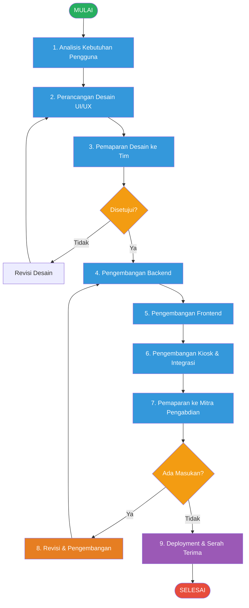

# Flowchart — Alur Pengembangan Proyek

```mermaid
flowchart TD
    A([MULAI]) --> B[1. Analisis Kebutuhan Pengguna]
    B --> C[2. Perancangan Desain UI/UX]
    C --> D[3. Pemaparan Desain ke Tim]
    D --> E{Disetujui?}
    E -->|Tidak| F[Revisi Desain]
    F --> C
    E -->|Ya| G[4. Pengembangan Backend]
    G --> H[5. Pengembangan Frontend]
    H --> I[6. Pengembangan Kiosk & Integrasi]
    I --> J[7. Pemaparan ke Mitra Pengabdian]
    J --> K{Ada Masukan?}
    K -->|Ya| L[8. Revisi & Pengembangan]
    L --> G
    K -->|Tidak| M[9. Deployment & Serah Terima]
    M --> N([SELESAI])

    style A fill:#27ae60,color:#fff
    style N fill:#e74c3c,color:#fff
    style E fill:#f39c12,color:#fff
    style K fill:#f39c12,color:#fff
    style B fill:#3498db,color:#fff
    style C fill:#3498db,color:#fff
    style D fill:#3498db,color:#fff
    style G fill:#3498db,color:#fff
    style H fill:#3498db,color:#fff
    style I fill:#3498db,color:#fff
    style J fill:#3498db,color:#fff
    style L fill:#e67e22,color:#fff
    style M fill:#9b59b6,color:#fff
```
