# Sitemap — Struktur Halaman Website

```mermaid
graph TD
    HOME["🏠 Beranda /"]

    HOME --> KATALOG["📚 Katalog /katalog"]
    HOME --> EDUKASI["📖 Edukasi /edukasi"]
    HOME --> TENTANG["ℹ️ Tentang /tentang"]
    HOME --> KUNJUNGI["📍 Kunjungi /kunjungi"]
    HOME --> KONTAK["✉️ Kontak /kontak"]
    HOME --> LOGIN["🔐 Login /login"]
    HOME --> KIOSK["🖥️ Kiosk /kiosk"]

    KATALOG --> KAT_DETAIL["Detail Spesies<br>/katalog/[slug]"]
    EDUKASI --> EDU_DETAIL["Detail Artikel<br>/edukasi/[slug]"]

    LOGIN --> ADMIN["⚙️ Admin Dashboard<br>/admin"]
    ADMIN --> ADM_POSTS["Manajemen Spesies<br>/admin/posts"]
    ADMIN --> ADM_KONTEN["Manajemen Artikel<br>/admin/konten"]
    ADMIN --> ADM_PAGES["Halaman Statis<br>/admin/pages"]
    ADMIN --> ADM_MEDIA["Media Library<br>/admin/media"]
    ADMIN --> ADM_USERS["Manajemen Pengguna<br>/admin/users"]
    ADMIN --> ADM_SETTINGS["Pengaturan<br>/admin/settings"]

    KIOSK --> KS_IDLE["Screensaver<br>IDLE"]
    KIOSK --> KS_HERITAGE["Living Heritage"]
    KIOSK --> KS_SITEMAP["Site Map"]
    KIOSK --> KS_INSEK["Virtual Insektarium"]
    KIOSK --> KS_META["Metamorfosis"]
    KIOSK --> KS_EKO["Ekosistem"]
    KIOSK --> KS_PANGAN["Ketahanan Pangan"]
    KIOSK --> KS_KOLAM["Kolam Megalitik"]
    KIOSK --> KS_CTA["Call to Action"]
    KIOSK --> KS_DATA["Data Spesies"]

    style HOME fill:#2c3e50,color:#fff
    style KATALOG fill:#3498db,color:#fff
    style EDUKASI fill:#3498db,color:#fff
    style TENTANG fill:#3498db,color:#fff
    style KUNJUNGI fill:#3498db,color:#fff
    style KONTAK fill:#3498db,color:#fff
    style LOGIN fill:#3498db,color:#fff
    style KIOSK fill:#9b59b6,color:#fff
    style ADMIN fill:#e67e22,color:#fff
    style ADM_POSTS fill:#e67e22,color:#fff
    style ADM_KONTEN fill:#e67e22,color:#fff
    style ADM_PAGES fill:#e67e22,color:#fff
    style ADM_MEDIA fill:#e67e22,color:#fff
    style ADM_USERS fill:#e67e22,color:#fff
    style ADM_SETTINGS fill:#e67e22,color:#fff
    style KAT_DETAIL fill:#3498db,color:#fff
    style EDU_DETAIL fill:#3498db,color:#fff
```

## Struktur Sitemap

| Section | Halaman | Route |
|---------|---------|-------|
| **Public** | Beranda | `/` |
| | Katalog Spesies | `/katalog` |
| | Detail Spesies | `/katalog/[slug]` |
| | Edukasi | `/edukasi` |
| | Detail Artikel | `/edukasi/[slug]` |
| | Tentang | `/tentang` |
| | Kunjungi | `/kunjungi` |
| | Kontak | `/kontak` |
| | Login | `/login` |
| **Admin** | Dashboard | `/admin` |
| | Manajemen Spesies | `/admin/posts` |
| | Manajemen Artikel | `/admin/konten` |
| | Halaman Statis | `/admin/pages` |
| | Media Library | `/admin/media` |
| | Manajemen Pengguna | `/admin/users` |
| | Pengaturan | `/admin/settings` |
| **Kiosk** | 10 Screen Interaktif | `/kiosk` |
